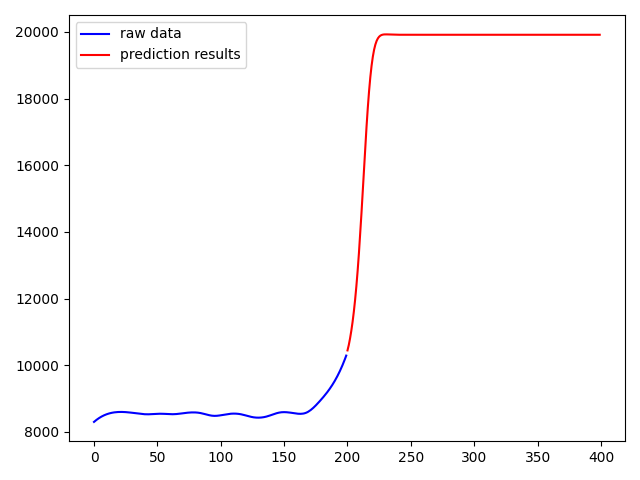

# PCR-Prediction

## Introduction
Predicting dynamic trends in PCR amplification curves in advance using a deep learning model.

## Prerequisites
- Linux MacOS Windows
- Python 3.6+
- CUDA
- Tensorflow-GPU Keras

## Installation
1. Create a conda virtual environment and activate it.

 ```shell
conda create -n pcr_prediction python=3.7 -y
conda activate pcr_prediction
```
   
2. Clone the PCR-Prediction repository.

```shell
git clone https://github.com/XinKai-Chen/PCR-Prediction.git
cd PCR-Prediction
```

3、Install the required packs

```shell
pip install -r requirements.txt
```
    
## Usage

```shell
python pcr_prediction.py
```

## demo



